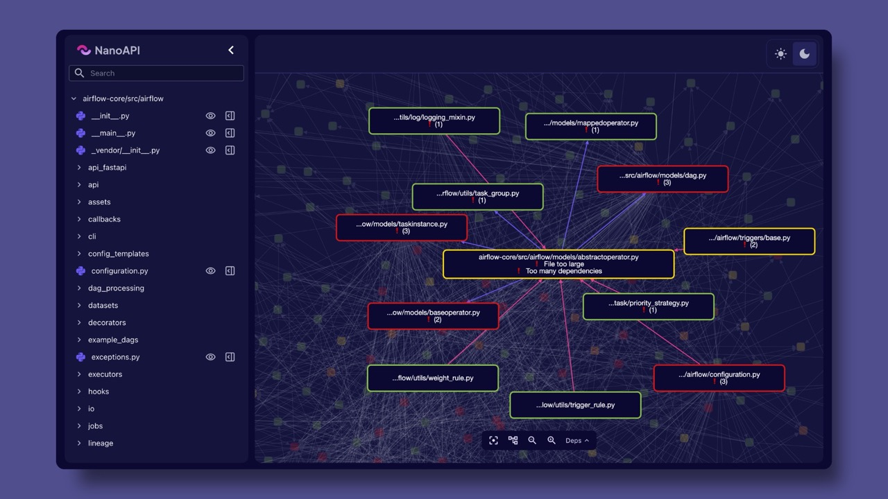

### Welcome to NanoAPI ⚡

[main repo](https://github.com/nanoapi-io/napi) | [docs](https://docs.nanoapi.io) | [blog](https://blog.nanoapi.io) | [contact](mailto:info@nanoapi.io)

NanoAPI is a tool built to reinvent the way teams interact with their software architecture in the age of AI. Tailored for developers, software architects, and CTOs, NanoAPI simplifies the process of developing, understanding, and refactoring your code through an intuitive UI and a visionary new symbol extraction engine. Whether you’re dealing with a sprawling legacy system or looking to streamline a modern codebase, NanoAPI helps you effortlessly understand, explore, and optimize your software architecture. 

Experience software architecture in the AI age. 

- High-level overviews and diagram documentation of your codebases.
- Group functionality together and extract microservices or smaller component services at build or deploy time.
- Use our dependency visualizer to get a better overview of your architectural complexity and feed information on how best to split a codebase.
- We're looking for design partners to help us shape the future of NanoAPI. If you're interested in getting early access and providing feedback, please apply by [sending us an email](mailto:info@nanoapi.io).

[Demo video available on YouTube](https://youtu.be/gDTcf5eesE8)

Our <a href="https://faircode.io/">Fair-code</a> approach means the tool is not a black box, you will always be able to see and understand exactly how it works on your codebase.

[nanoapi.io](https://nanoapi.io)
