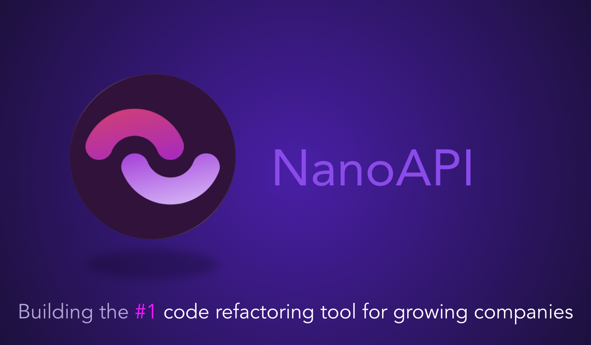

### Welcome to NanoAPI ⚡

[main repo](https://github.com/nanoapi-io/napi) | [docs](https:docs.nanoapi.io) | [blog](https://blog.nanoapi.io) | [contact](mailto:info@nanoapi.io)

NanoAPI is a tool built to reinvent development of complex API codebases. Tailored for developers, software architects, and CTOs, NanoAPI simplifies the process of developing, understanding, and refactoring your API through an intuitive UI and a language-agnostic code-splitting engine. Whether you’re dealing with a sprawling legacy API or looking to streamline a modern codebase, NanoAPI helps you effortlessly break down monolithic codebases, refactor, and optimize your API architecture. 

Experience a new development paradigm where software is written as monoliths and deployed as microservices. 

- High-level overviews and documentation of your APIs.
- Group similar APIs together and extract microservices or smaller component APIs at build or deploy time.
- (Experimental) Use our dependency visualizer to get a better overview of your architectural complexity and feed information on how best to split a codebase.
- We're looking for design partners to help us shape the future of NanoAPI. If you're interested in getting early access and providing feedback, please apply by [sending us an email](mailto:info@nanoapi.io).

[Demo video available on YouTube](https://youtu.be/-07KRt7HWdE)

NanoAPI is steadily growing:
- 🌟 Our team has been inducted into [Techstars Berlin](https://www.linkedin.com/feed/update/urn:li:activity:7239236320504532993/), who have thrown their full support and funding behind our project.
- 🧑‍💻 We've hired our first engineer, and are looking to add DevRel and DevExp roles to our team.
- ⛰️ We're looking for investors and supporters who are willing to join, engage, and contribute to democratizing software that large consulting firms have kept behind closed doors for far too long.

Our <a href="https://faircode.io/">Fair-code</a> approach means the tool is not a black box, you will always be able to see and understand exactly how it works on your codebase.

[nanoapi.io](https://nanoapi.io)
